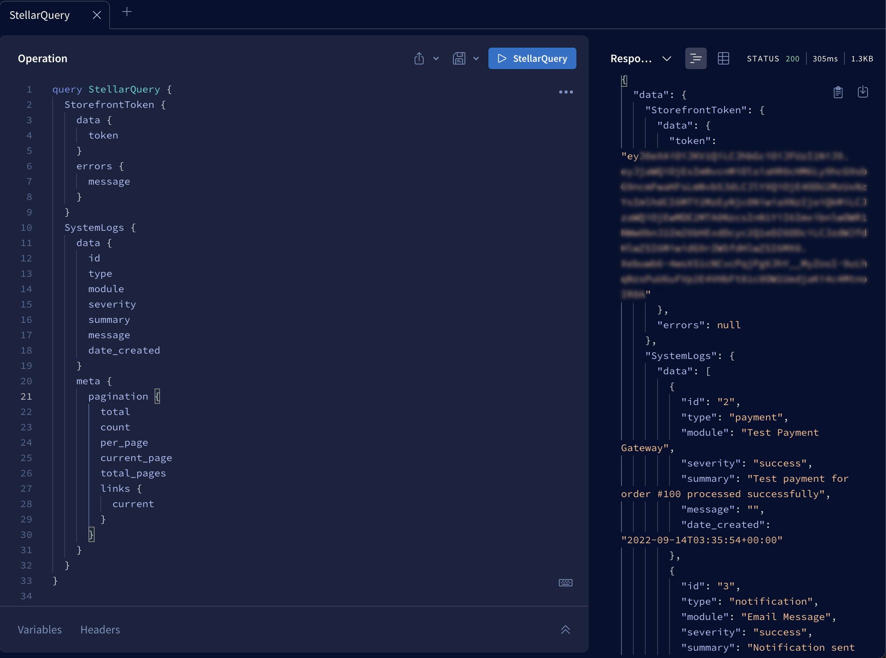

# Stellar

Proof of Concept Apollo Federation / supergraph for entry in BigCommerce's first [BigHackathon](https://twitter.com/hashtag/bighackathon). [What is the supergraph?](https://www.apollographql.com/blog/announcement/backend/the-supergraph-a-new-way-to-think-about-graphql/)

Gateway and BigCommerce subgraph initial structure setup with quirks (e.g. incomplete schema, GQL queries incomplete).

Starting with Products / Customers subgraph would have resulted in queries to workaround login requirement, but wouldn't have unlocked more of the BigCommerce graph like login or wishlist would (being Mutations).

Contributions are welcome! [There are many types that could be implemented as subgraphs](https://developer.bigcommerce.com/graphql-api-reference).

## BigCommerce subgraph

### Usage

Query for a [Storefront API Token](https://developer.bigcommerce.com/api-reference/044bc7b21e5b4-create-a-token) with StorefrontToken:
```
query StellarQuery {
  StorefrontToken {
    data {
      token
    }
    errors {
      message
    }
  }
}
```
A store's [system logs] can be queried as well:
```
query StellarQuery {
SystemLogs {
    data {
      id
      type
      module
      severity
      summary
      message
      date_created
    }
    meta {
      pagination {
        total
        count
        per_page
        current_page
        total_pages
        links {
          current
        }
      }
    }
  }
}
```
Here's an example of both in action:



## Products subgraph
// TODO
## Customers subgraph
// TODO
