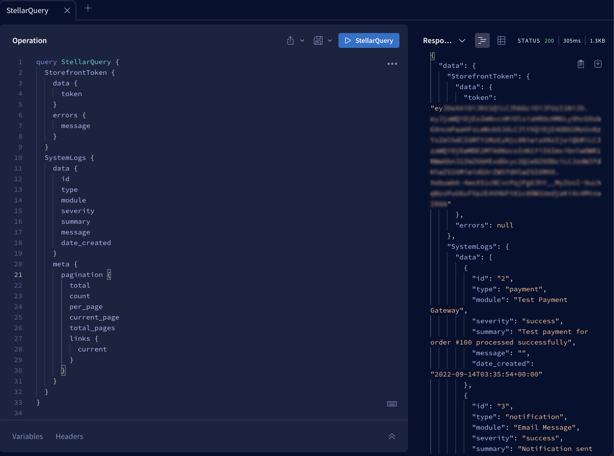

# Stellar

A lean Apollo Federation / supergraph blueprint for BigCommerce headless
storefronts. Started as a proof-of-concept entry for BigCommerce's first
[BigHackathon](https://twitter.com/hashtag/bighackathon) ([what's a supergraph?](https://www.apollographql.com/blog/announcement/backend/the-supergraph-a-new-way-to-think-about-graphql/)),
it's now restructured per ADR-002 into infrastructure plumbing that's ready
to build on: a working gateway, a working auth handshake, and clean
placeholder subgraphs in place of a half-finished product model to strip out.

## Quick start

```
npm install
cp .env.example .env   # fill in BIGC_STORE_HASH and BIGC_ACCESS_TOKEN
npm run dev
```

This boots the gateway and every subgraph concurrently. The gateway
introspects and composes its subgraphs at startup (`IntrospectAndCompose`),
so there's no `rover` CLI step or pre-composed supergraph file required to
run locally -- it just runs.

## Subgraphs

| Subgraph | Status | What it does |
|---|---|---|
| `storefront` | Working | Mints a [Storefront API Token](https://developer.bigcommerce.com/api-reference/044bc7b21e5b4-create-a-token) -- the auth handshake the rest of the graph builds on |
| `storeLogs` | Working | Reads a store's [system logs](https://developer.bigcommerce.com/api-reference/6908d02370409-get-system-logs) |
| `catalog` | Placeholder | Wired into the graph and ready for your own product model -- the full [Catalog API](https://developer.bigcommerce.com/graphql-api-reference) is intentionally not mapped here |
| `customers` | Placeholder | Wired into the graph and ready to pair with the StorefrontToken handshake for login/account flows |

Mapping the full BigCommerce GraphQL API is a big job and store-specific by
nature -- inheriting someone else's product model usually creates more cleanup
work than it saves. Contributions that federate more of it are welcome, but
the `catalog`/`customers` placeholders are deliberately left for you to shape.

## Usage

Query for a Storefront API Token:
```
query StellarQuery {
  StorefrontToken {
    data {
      token
    }
    errors {
      message
    }
  }
}
```

A store's system logs can be queried as well:
```
query StellarQuery {
  SystemLogs {
    data {
      id
      type
      module
      severity
      summary
      message
      date_created
    }
    meta {
      pagination {
        total
        count
        per_page
        current_page
        total_pages
        links {
          current
        }
      }
    }
  }
}
```

Here's an example of both in action:


